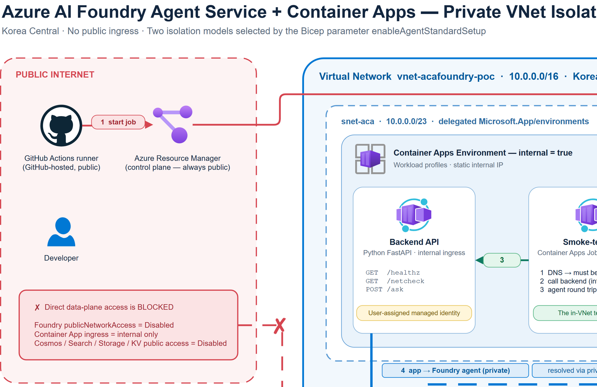

# Azure private Foundry Agent PoC

This proof of concept deploys an Azure Container Apps backend and Azure AI Foundry Agent Service into the same isolated Azure Virtual Network. The default path is the Basic Foundry Agent setup with inbound private isolation; it was deployed, tested, and verified end to end. The template can also opt into Standard setup with network injection for teams that need bring-your-own backing services.

## Contents

- [Architecture](#architecture)
- [How the isolation works](#how-the-isolation-works)
- [Prerequisites](#prerequisites)
- [Run in GitHub Codespaces](#run-in-github-codespaces)
- [Deploy from the command line](#deploy-from-the-command-line)
- [Set up the CI/CD pipeline](#set-up-the-cicd-pipeline)
- [Verify](#verify)
- [Cost](#cost)
- [Implementation notes](#implementation-notes)
- [Teardown](#teardown)
- [Known issues and gotchas](#known-issues-and-gotchas)
- [License](#license)

## Architecture

**▶ [Open the interactive architecture diagram](https://studydev.github.io/azure-private-foundry-agent-poc/diagram/architecture.svg)**

[](https://studydev.github.io/azure-private-foundry-agent-poc/diagram/architecture.svg)

> The PNG is a static preview. The source diagram is [`diagram/architecture.drawio`](diagram/architecture.drawio), which can be opened in any draw.io client.

## How the isolation works

`enableAgentStandardSetup` selects the Foundry Agent isolation model. It defaults to `false`.

| Model | Parameter | What runs where | What is deployed | Approximate cost | Provisioning | Status |
| --- | --- | --- | --- | ---: | --- | --- |
| **Basic setup + inbound private isolation** | `enableAgentStandardSetup=false` | Foundry account data plane is private via private endpoint. Agent runtime, thread storage, and file storage are Microsoft-managed. Container Apps runs in an internal managed environment in the VNet. | Foundry account/project, Foundry private endpoint and DNS, internal Container Apps environment/app/job, ACR, managed identity, role assignments, Log Analytics. **No Cosmos DB, AI Search, Key Vault, or dependency private endpoints.** | **~$25–40/month** | About 7 minutes observed | **Default and verified end to end** |
| **Standard setup with network injection** | `enableAgentStandardSetup=true` | Foundry Agent runtime is injected into `snet-agent`. Thread/vector/file storage use BYO Cosmos DB, AI Search, and Storage through a project capability host. | Everything in Basic, plus Cosmos DB, AI Search, Storage, Key Vault, dependency private endpoints, project connections, and an `Agents` capability host. | **~$135–160/month** | Can take much longer; see [Known issues and gotchas](#known-issues-and-gotchas) | Available, but validate before relying on it |

The deployment creates a single VNet (`10.0.0.0/16`) with three subnets:

| Subnet | CIDR | Purpose | Delegation |
| --- | --- | --- | --- |
| `snet-aca` | `10.0.0.0/23` | Internal Azure Container Apps environment | `Microsoft.App/environments` |
| `snet-agent` | `10.0.4.0/24` | Foundry Agent network injection when Standard setup is enabled | `Microsoft.App/environments` |
| `snet-pe` | `10.0.8.0/26` | Private endpoints | none |

In both models, the Foundry account is created with `publicNetworkAccess: 'Disabled'` and `disableLocalAuth: true`. In Basic setup, private ingress is the isolation boundary: the public data plane returns HTTP 403 even with a valid Entra token, while VNet clients resolve the Foundry FQDN to the private endpoint IP.

In Standard setup, `networkInjections` is added at Foundry account creation time and points to `snet-agent`. That setting is effectively a creation-time choice for this PoC.

Container Apps internal ingress also needs DNS. Azure does not automatically create a private zone for the managed environment default domain, so the template creates a zone named after that default domain and adds apex (`@`) and wildcard (`*`) A records to the environment static IP. An internal Container Apps app resolves as `<app>.internal.<defaultDomain>`; use the container app module's `fqdn` output rather than building the FQDN by hand.

## Prerequisites

- Azure subscription with access to Azure Container Apps, Azure AI Foundry, Azure Container Registry, private endpoints, managed identities, and role assignments in the target region.
- If `enableAgentStandardSetup=true`, also ensure access to Azure AI Search, Azure Cosmos DB, Storage, and Key Vault.
- Azure CLI with the Bicep extension.
- GitHub CLI.
- Docker is not required locally when you use `az acr build`.
- Permissions to create resource groups, assign Azure roles, and create GitHub repository secrets and environments.

## Run in GitHub Codespaces

1. Open this repository in GitHub Codespaces.
2. Sign in to Azure:

   ```bash
   az login
   az account set --subscription "<your-subscription-id>"
   ```

3. Deploy the infrastructure with the placeholder image. This uses the default Basic setup unless you append `enableAgentStandardSetup=true`.

   ```bash
   az deployment sub create \
     --name aca-foundry-private-poc \
     --location koreacentral \
     --template-file infra/main.bicep \
     --parameters infra/main.bicepparam
   ```

4. Build the app into ACR and redeploy with the real image, as shown in the next section.

## Deploy from the command line

The image has a chicken-and-egg sequence: the first deployment creates ACR and Container Apps with a public MCR placeholder image, then ACR builds the real app image, then the deployment runs again with the real tag.

The following Bash commands deploy the default, verified Basic setup:

```bash
az deployment sub create \
  --name aca-foundry-private-placeholder \
  --location koreacentral \
  --template-file infra/main.bicep \
  --parameters infra/main.bicepparam

RG=$(az deployment sub show \
  --name aca-foundry-private-placeholder \
  --query properties.outputs.resourceGroupName.value \
  -o tsv)
ACR=$(az deployment sub show \
  --name aca-foundry-private-placeholder \
  --query properties.outputs.acrName.value \
  -o tsv)
IMAGE="$ACR.azurecr.io/private-agent:$(git rev-parse --short HEAD)"

az acr build \
  --registry "$ACR" \
  --image "private-agent:$(git rev-parse --short HEAD)" \
  --file src/Dockerfile \
  src

az deployment sub create \
  --name aca-foundry-private-final \
  --location koreacentral \
  --template-file infra/main.bicep \
  --parameters infra/main.bicepparam \
  --parameters containerImage="$IMAGE"
```

To opt into Standard setup with network injection, add `enableAgentStandardSetup=true` to both deployment commands:

```bash
az deployment sub create \
  --name aca-foundry-private-placeholder \
  --location koreacentral \
  --template-file infra/main.bicep \
  --parameters infra/main.bicepparam enableAgentStandardSetup=true

az deployment sub create \
  --name aca-foundry-private-final \
  --location koreacentral \
  --template-file infra/main.bicep \
  --parameters infra/main.bicepparam \
  --parameters containerImage="$IMAGE" enableAgentStandardSetup=true
```

ARM returning `Succeeded` does not mean the Foundry data plane, RBAC assignments, private DNS, Container Apps revisions, and cold starts are ready. Allow a few minutes after deployment and use retries before testing.

## Set up the CI/CD pipeline

The workflows use GitHub OIDC with no Azure credentials stored in code. Because this is a public repository, the Azure identifiers are stored as GitHub **Secrets**, not Variables. Secrets are masked in logs; Variables are not designed to protect values printed by workflows in public logs.

```bash
OWNER=studydev
REPO=azure-private-foundry-agent-poc
SUBSCRIPTION_ID=<your-subscription-id>
TENANT_ID=<your-tenant-id>
LOCATION=koreacentral
BOOTSTRAP_RG=rg-foundry-agent-poc-oidc
IDENTITY_NAME=uami-github-oidc-foundry-poc

az account set --subscription "$SUBSCRIPTION_ID"
az group create \
  --name "$BOOTSTRAP_RG" \
  --location "$LOCATION"

az identity create \
  --resource-group "$BOOTSTRAP_RG" \
  --name "$IDENTITY_NAME" \
  --location "$LOCATION"

CLIENT_ID=$(az identity show \
  --resource-group "$BOOTSTRAP_RG" \
  --name "$IDENTITY_NAME" \
  --query clientId -o tsv)
PRINCIPAL_ID=$(az identity show \
  --resource-group "$BOOTSTRAP_RG" \
  --name "$IDENTITY_NAME" \
  --query principalId -o tsv)

az identity federated-credential create \
  --resource-group "$BOOTSTRAP_RG" \
  --identity-name "$IDENTITY_NAME" \
  --name main \
  --issuer "https://token.actions.githubusercontent.com" \
  --subject "repo:$OWNER/$REPO:ref:refs/heads/main" \
  --audiences "api://AzureADTokenExchange"

az identity federated-credential create \
  --resource-group "$BOOTSTRAP_RG" \
  --identity-name "$IDENTITY_NAME" \
  --name pull-request \
  --issuer "https://token.actions.githubusercontent.com" \
  --subject "repo:$OWNER/$REPO:pull_request" \
  --audiences "api://AzureADTokenExchange"

az identity federated-credential create \
  --resource-group "$BOOTSTRAP_RG" \
  --identity-name "$IDENTITY_NAME" \
  --name production \
  --issuer "https://token.actions.githubusercontent.com" \
  --subject "repo:$OWNER/$REPO:environment:production" \
  --audiences "api://AzureADTokenExchange"

az role assignment create \
  --assignee-object-id "$PRINCIPAL_ID" \
  --assignee-principal-type ServicePrincipal \
  --role Contributor \
  --scope "/subscriptions/$SUBSCRIPTION_ID"

az role assignment create \
  --assignee-object-id "$PRINCIPAL_ID" \
  --assignee-principal-type ServicePrincipal \
  --role "Role Based Access Control Administrator" \
  --scope "/subscriptions/$SUBSCRIPTION_ID"

gh secret set AZURE_CLIENT_ID --repo "$OWNER/$REPO" --body "$CLIENT_ID"
gh secret set AZURE_TENANT_ID --repo "$OWNER/$REPO" --body "$TENANT_ID"
gh secret set AZURE_SUBSCRIPTION_ID --repo "$OWNER/$REPO" --body "$SUBSCRIPTION_ID"

gh api --method PUT "repos/$OWNER/$REPO/environments/production" \
  --field wait_timer=0
```

Then add a required reviewer to the `production` environment in the GitHub repository settings. The deploy workflow is intentionally gated by that environment.

## Verify

Verification runs **inside** the VNet, but it can be started from a public machine through the ARM control plane. Use the console log stream and the manual-trigger Container Apps Job as the reliable signals.

Two positive verification mechanisms are included:

1. The backend runs a startup self-test and prints the result to its console log. The app has no public ingress, but the log is readable through ARM:

   ```bash
   DEPLOYMENT=aca-foundry-private-final
   RG=$(az deployment sub show \
     --name "$DEPLOYMENT" \
     --query properties.outputs.resourceGroupName.value \
     -o tsv)
   APP=$(az deployment sub show \
     --name "$DEPLOYMENT" \
     --query properties.outputs.containerAppName.value \
     -o tsv)

   az containerapp logs show \
     --resource-group "$RG" \
     --name "$APP" \
     --tail 100
   ```

2. A manual-trigger Container Apps Job runs the same checks and exits non-zero on failure:

   ```bash
   JOB=$(az deployment sub show \
     --name "$DEPLOYMENT" \
     --query properties.outputs.verifyJobName.value \
     -o tsv)

   az containerapp job start \
     --resource-group "$RG" \
     --name "$JOB"

   az containerapp job execution list \
     --resource-group "$RG" \
     --name "$JOB" \
     --query "[].{name:name,status:properties.status}" \
     -o table
   ```

Observed Basic-setup results:

| Signal | Result |
| --- | --- |
| Foundry DNS from inside the VNet | `DNS  foundry   ai-<name>.services.ai.azure.com -> ['10.0.8.6'] private=True` |
| Agent round trip | `AGENT round trip ok=True reply='PRIVATE_AGENT_PASS'` |
| Backend startup self-test | `SELFTEST PASS` |
| Container Apps Job execution | `Succeeded` |

Negative control from the public internet:

| Check | Result |
| --- | --- |
| Resolve the app's internal FQDN | Fails to resolve; no such host |
| Resolve the Foundry FQDN | Resolves to a public address because of split-horizon DNS; inside the VNet the same name resolves to `10.0.8.6` |
| Call the Foundry data plane with a valid Entra token | **HTTP 403** because `publicNetworkAccess: Disabled` blocks public data-plane access |

Log Analytics ingestion was **not** observed for this environment during testing; no tables were created. Do not depend on a Log Analytics KQL query alone. Prefer the console log stream and the job exit code.

## Cost

Approximate monthly cost while the lab is running. Model usage is workload-dependent and not included.

### Basic setup + inbound private isolation (`enableAgentStandardSetup=false`)

| Component | Estimate |
| --- | ---: |
| Foundry private endpoint | ~$10–15 |
| Container Apps | ~$5–10 |
| ACR Basic | ~$5 |
| Log Analytics / DNS / miscellaneous | ~$5–10 |
| **Total** | **~$25–40/month while running** |

### Standard setup with network injection (`enableAgentStandardSetup=true`)

| Component | Estimate |
| --- | ---: |
| AI Search Basic | ~$75 |
| Private endpoints | ~$44 |
| Container Apps | ~$10 |
| Cosmos DB serverless | ~$10 |
| ACR Basic | ~$5 |
| Storage, Key Vault, Log Analytics, DNS, miscellaneous | ~$5–15 |
| **Total** | **~$135–160/month while running** |

Tear down the lab when idle.

## Implementation notes

The current template includes fixes for issues found during live Azure validation:

1. At subscription target scope, `resourceId(resourceGroupName, type, name)` binds the extra argument as a subscription ID and fails. Use `resourceId(subscription().subscriptionId, resourceGroupName, type, name)`.
2. `gpt-4o-mini` version `2024-07-18` is in a deprecating state and is rejected for new deployments. The template uses `gpt-4.1-mini` version `2025-04-14` with `GlobalStandard` capacity.
3. Azure Container Registry Basic SKU rejects a network rule set. AVM writes one whenever public access is enabled and the default action is `Deny`, so `networkRuleSetDefaultAction: 'Allow'` is required on Basic.
4. A Container Apps environment cannot be read with an `existing` reference from a subscription-scope deployment. ARM resolves it eagerly, independent of `dependsOn`, and fails with `ResourceNotFound`. Use the module's `defaultDomain` and `staticIp` outputs.
5. `platformReservedCidr` and `platformReservedDnsIP` are Consumption-only and are rejected on a workload-profiles Container Apps environment.
6. An internal Container Apps environment publishes apps at `<app>.internal.<defaultDomain>`, including the extra `internal` label. Use the container app module's `fqdn` output.
7. `DefaultAzureCredential` requests the system-assigned identity unless `AZURE_CLIENT_ID` is set. With only a user-assigned identity attached, the agent call fails to authenticate until that variable is provided.
8. The network check treats an unset dependency FQDN as not applicable rather than failure, so the same image works in both isolation models.

## Teardown

Use the teardown workflow and type the resource group name when prompted. It deletes the project capability host if present because that resource can block resource-group deletion, then deletes the resource group, then purges soft-deleted Foundry and Key Vault resources if present.

Manual equivalent:

```bash
RG=rg-aca-foundry-private-agent-poc

for id in $(az resource list \
  --resource-group "$RG" \
  --resource-type "Microsoft.CognitiveServices/accounts/projects/capabilityHosts" \
  --query "[].id" -o tsv); do
  az resource delete \
    --ids "$id" \
    --api-version 2025-12-01
done

az cognitiveservices account list \
  --resource-group "$RG" \
  --query "[?kind=='AIServices'].[name,location]" \
  -o tsv > foundry-to-purge.tsv
az keyvault list \
  --resource-group "$RG" \
  --query "[].[name,location]" \
  -o tsv > keyvaults-to-purge.tsv

az group delete \
  --name "$RG" \
  --yes

while IFS=$'\t' read -r name location; do
  az cognitiveservices account purge \
    --name "$name" \
    --location "$location"
done < foundry-to-purge.tsv

while IFS=$'\t' read -r name location; do
  az keyvault purge \
    --name "$name" \
    --location "$location"
done < keyvaults-to-purge.tsv
```

## Known issues and gotchas

- With `enableAgentStandardSetup=true`, the `Microsoft.CognitiveServices/accounts` resource can remain in `Creating` state indefinitely when the account is created with `networkInjections` as part of the full template. This was observed for well over one hour with no error surfaced by ARM. Controlled minimal reproductions each succeeded in 7–13 minutes, isolating these as **not** the cause: the region, `publicNetworkAccess: 'Disabled'`, `disableLocalAuth: true`, the inline model deployment, private DNS zones linked to the VNet before the private endpoint exists, and a Container Apps environment coexisting in the same VNet. Root cause is still unresolved; treat network injection as needing extra provisioning time and verify before relying on it. The Basic-setup path is unaffected.
- Deployment ordering matters: VNet and DNS, private endpoints, Foundry account, Foundry project, optional dependency connections, RBAC, optional capability host, Container Apps, then the smoke-test job.
- Foundry capability hosts are immutable for several settings. Delete and recreate the project capability host when those settings change.
- RBAC propagation can take several minutes. Use bounded retries rather than assuming ARM completion means data-plane readiness.
- `networkInjections` is creation-time-only for this PoC. Create the Foundry account with it from the start if you need Standard setup.
- Subnet sizing matters. The Container Apps environment uses `/23`, the injected agent runtime uses `/24`, and private endpoints use `/26`.
- Class A private ranges and Foundry private networking can have regional constraints. Validate region support before changing `koreacentral`.

## License

This project is licensed under the MIT License. See [LICENSE](LICENSE).
